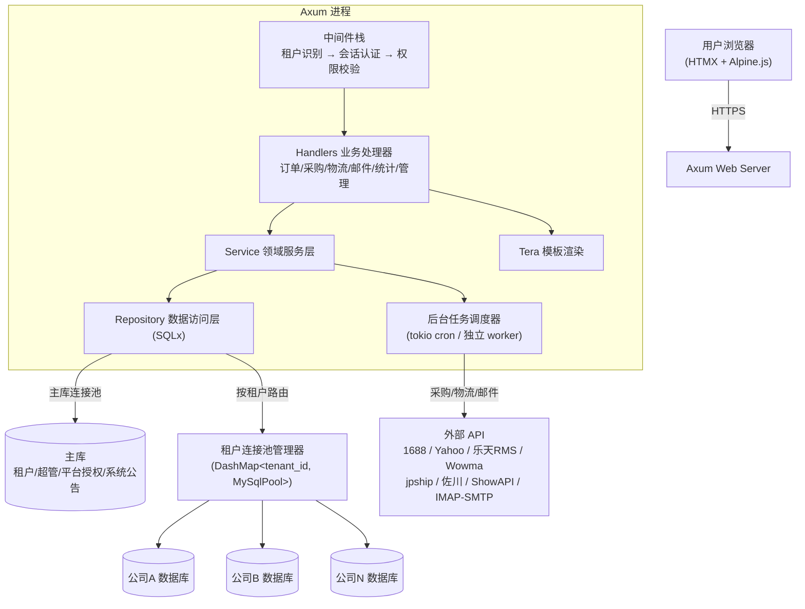
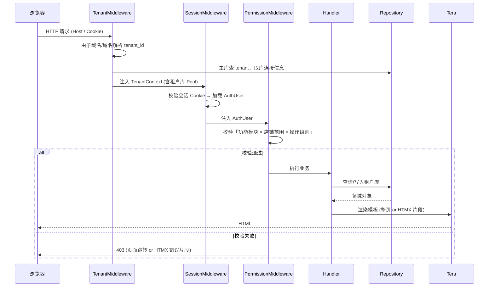
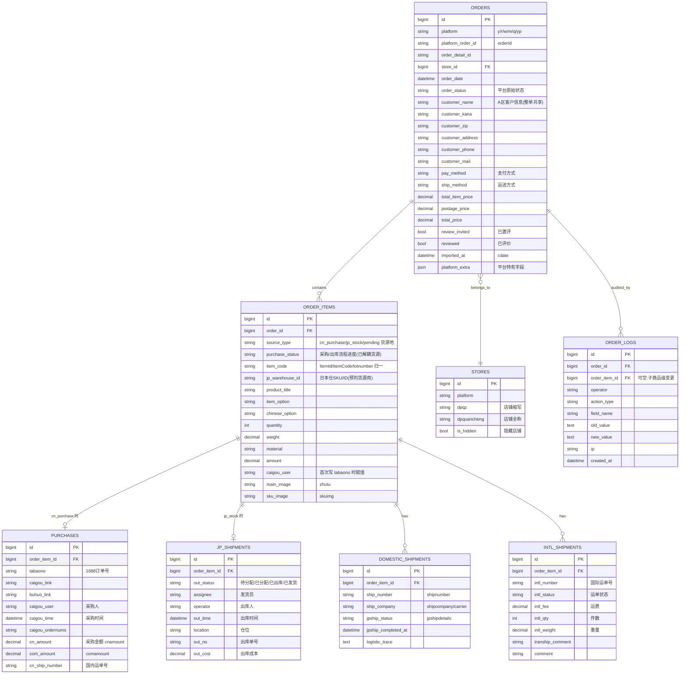
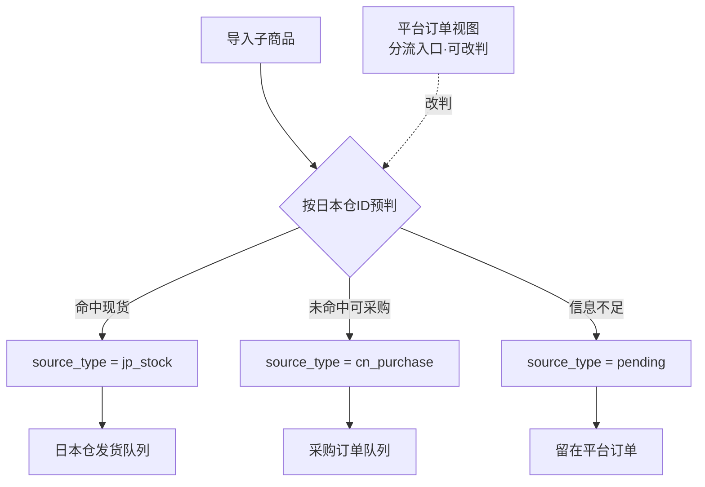
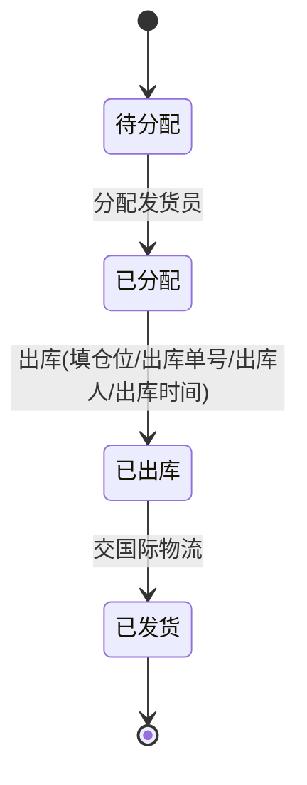
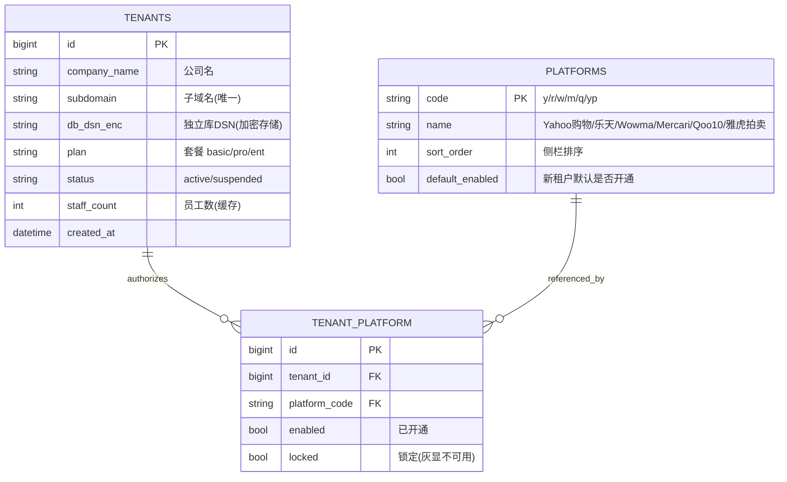
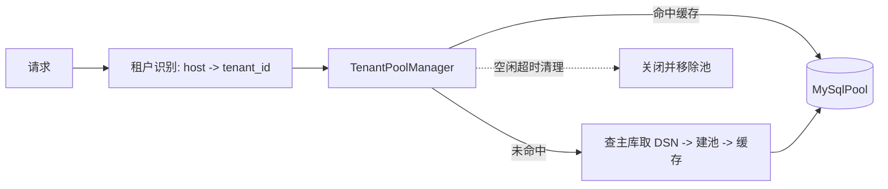
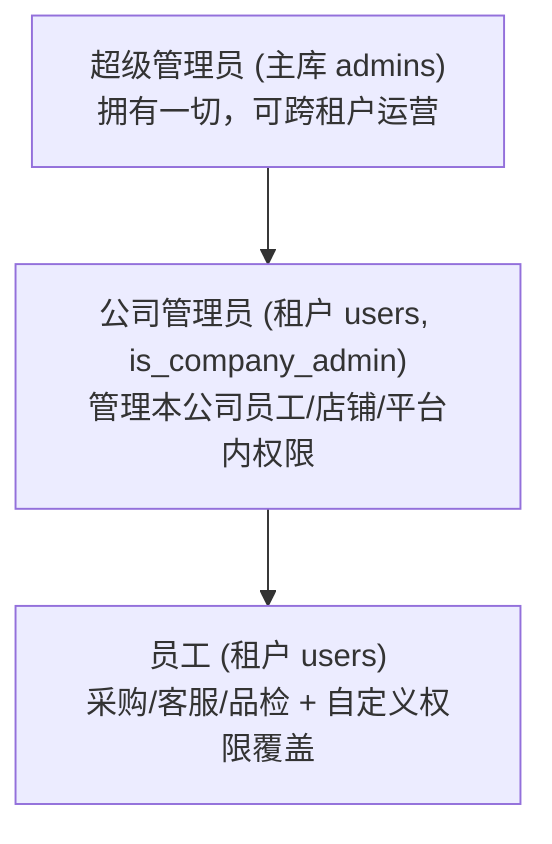
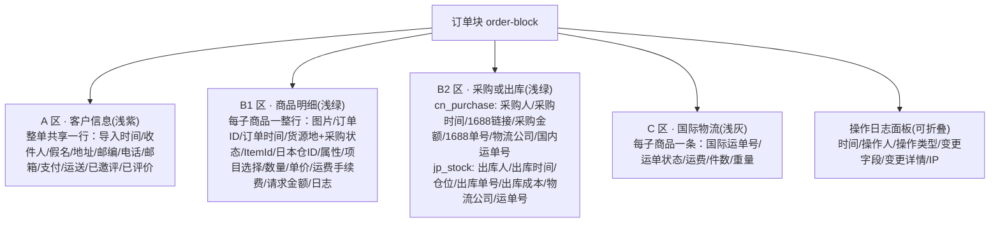
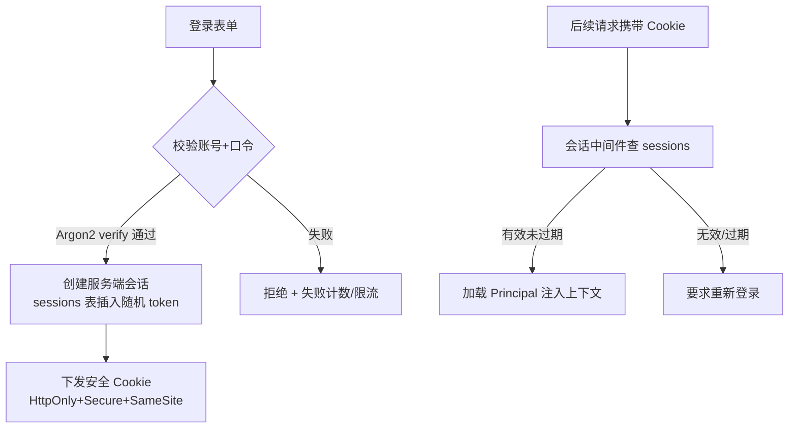

# 设计文档：西阵订单系统重写（order-system-rewrite）

> 将现有 PHP 跨境电商订单系统（xizhends，覆盖 6 个日本电商平台）用 Rust 重写为多租户 SaaS。
> 本文档在初稿 `DESIGN.md` 的基础上补全：统一订单数据模型、多租户连接池、后台能力模块迁移、三维 + 层级权限模型、数据迁移方案、认证升级。
>
> **本阶段产出纯设计，不写任何业务代码。** 文档中的 Rust 代码仅为接口契约与算法说明，用于指导后续开发。

---

## Overview

> 对应章节：一、概述

xizhends 是西阵跨境电商团队使用多年的订单中台，覆盖 6 个日本电商平台（Yahoo购物 `y`、乐天 `r`、Wowma `w`、Mercari `m`、Qoo10 `q`、雅虎拍卖 `yp`）。现有系统是无框架 PHP，每个平台一个镜像目录、一张约 60 列的扁平大宽表，把「客户信息 / 商品明细 / 国内采购 / 国内物流 / 国际物流」揉在一行；登录用明文密码 + Session 魔法字符串；后台能力（1688 采购、平台 OAuth、日本物流查询、9 个 cron、客服邮件中心、各类统计）以插件目录形式堆叠。

重写目标是把它做成**多租户 SaaS**：每家公司（租户）一个独立 MySQL 数据库，超管统一运营，公司管理员管理自己的员工与店铺。技术栈已定：**Rust + Axum（Web）+ Tera（模板）+ HTMX/Alpine.js（前端增强）+ SQLx（异步查询）+ MySQL**。

本设计遵循三个原则：
1. **忠于现有行为**：表结构、状态机、统计口径、cron 语义、权限语义都从 old 系统的实际代码反推，不臆造。
2. **结构化取代扁平化**：把 6 张同构镜像宽表归一为一套规范化的统一模型，平台差异以「平台标识 + 扩展字段」容纳。
3. **安全与隔离优先**：密码哈希、安全会话、按租户的数据库物理隔离。

---

## Architecture

> 对应章节：二、系统架构

### 2.1 总体分层



### 2.2 请求生命周期



### 2.3 目录结构规划

```
src/
├── main.rs                  # 启动入口：加载配置、建主库池、挂载路由与中间件、启动调度器
├── config.rs                # AppConfig（监听地址、主库 DSN、密钥、外部 API 凭证路径）
├── error.rs                 # 统一 AppError + IntoResponse
├── state.rs                 # AppState（主库池 + TenantPoolManager + Tera + 配置）
├── middleware/
│   ├── tenant.rs            # 租户识别 → 注入 TenantContext
│   ├── session.rs           # 会话校验 → 注入 AuthUser
│   └── permission.rs        # 权限校验（提取器 + 守卫宏）
├── models/                  # 统一领域模型（结构化）
│   ├── order.rs             # Order 聚合根 + OrderItem + Purchase + DomesticShip + IntlShip
│   ├── store.rs             # Store 店铺
│   ├── user.rs              # User 员工 / Admin 超管
│   ├── tenant.rs            # Tenant 租户
│   └── platform.rs          # Platform 枚举与平台元数据
├── repository/              # SQLx 数据访问
│   ├── order_repo.rs
│   ├── store_repo.rs
│   ├── user_repo.rs
│   └── tenant_repo.rs       # 仅访问主库
├── services/                # 领域服务（编排、业务规则）
│   ├── order_service.rs
│   ├── purchase_service.rs  # 采购/caigou_user 赋值规则
│   ├── stats_service.rs     # caigou_stats / 采购状态统计 / 利润核算
│   └── search_service.rs    # 全局搜索
├── handlers/                # HTTP 处理器（薄）
│   ├── auth.rs  dashboard.rs  order_list.rs  order_detail.rs  order_save.rs
│   ├── import_export.rs  search.rs  mail.rs  stats.rs
│   └── admin/               # 超管 + 公司管理（租户/员工/店铺/平台授权）
├── integrations/            # 外部能力适配（trait + 各实现）
│   ├── purchase_1688.rs  oauth_yahoo.rs  oauth_rakuten.rs  oauth_wowma.rs
│   ├── ship_jp.rs           # jpship/佐川/ShowAPI carrier 识别 + 查询
│   └── mail.rs              # IMAP/SMTP 聚合
├── jobs/                    # 9 个定时任务（与 cron 语义一一对应）
│   ├── scheduler.rs
│   ├── update_1688_logistics.rs  update_jpship_logistics.rs  order_monitor.rs
│   ├── zhutu_downloader.rs  order_archive.rs  mail_sync.rs
│   ├── caigou_status_stats.rs  cleanup_old_images.rs  daily_maintain.rs
├── db/
│   ├── pool.rs              # TenantPoolManager（多租户连接池生命周期）
│   └── migrate.rs           # 迁移工具：单库 6 镜像表 → 每租户独立库 + 统一表
└── templates/               # Tera 模板
    ├── layout.html  dashboard.html  order_list.html  order_detail.html ...
```

### 2.4 关键设计决策与理由

| 决策 | 选择 | 理由 |
|------|------|------|
| 多租户隔离 | 每租户独立数据库 | 沿用既定方案；隔离性最强、合规简单、单租户故障不扩散；代价是连接池管理复杂（见第四章） |
| 租户识别 | 子域名 / 自定义域名 → 主库映射 | 无需在每条 SQL 携带 tenant_id；与「独立库」物理隔离天然匹配 |
| 订单建模 | 一套规范化表（order 聚合 + 子表），平台差异入 `platform` 列 + `platform_extra` JSON | 消除 6 张镜像宽表，统一查询；保留平台特有字段不丢信息 |
| 数据访问 | SQLx（非编译期校验宏，使用运行时 query + 手动映射） | 租户库在编译期不存在，无法用 `query!` 宏校验；统一用 `query_as` + 显式 SQL |
| 后台能力 | trait 抽象 + 平台/承运商各自实现 | old 系统按平台/承运商分散；trait 统一接口，新增平台只实现 trait |
| 认证 | Argon2 密码哈希 + 服务端会话表 | 取代明文密码 + 魔法字符串 |

---

## Data Models

> 对应章节：三、统一订单数据模型 + 主库表结构（平台目录 / 平台授权 / 租户，见 3.8）。
> 本节定义统一订单领域模型（订单聚合 + 语义子表）与主库全局表，作为后续组件与接口的契约基础。

### 3.1 现状：6 张同构镜像宽表

old 系统 `ph_ordery / ph_orderr / ph_orderw / ph_orderm / ph_orderq / ph_orderyp` 结构基本一致（见 `create_ph_orderyp.sql`），约 60 个扁平字段把 5 类信息揉在一行。按语义可归为：

| 语义组 | 代表字段（old 扁平列） |
|--------|------------------------|
| 客户/收件信息 | `senderName senderKana senderAddress senderZipCode senderPhoneNumber1 mailAddress shipping_state shipping_city shipping_address_1/2 shipping_postal_code receipt_city deliveryName` |
| 订单头 | `orderId orderDetailId orderDate orderStatus settlementName totalItemPrice postagePrice totalPrice unit cdate user_name` |
| 商品明细 | `itemCode lotnumber itemManagementId product_title itemOption chinese_option quantity weight material amount skuimg zhutu itemOptionCommission1..5` |
| 采购信息 | `caigoutime caigoulink buhuolink tabaono caigou_ordernums caigou_user cnamount comamount status beizhu beizhu_log` |
| 国内物流(日本境内) | `shipnumber shipcompany shipno shipquantity jpshipdetails jpship_completed_at logisticstatus logisticstrace` |
| 国际物流/其他 | `tranship_comment comment review 字段` |

> 关键事实（必须忠实保留）：
> - `beizhu` 实际承载**采购状态机**（值如「已发货代订单」「已发日本」「已发出荷通知」「国内采购-准备」「国内采购-已采购」），`beizhu_log` 是其变更日志。
> - `caigou_user` 在**首次写入 `tabaono`（1688 订单号）时**由 `$_SESSION['username']` 赋值一次，后续不覆盖。
> - 不同平台「商品编码」字段名不同：`y/r` 用 `ItemId`、`w/q` 用 `itemCode`、`m/yp` 用 `lotnumber`（见 `order_monitor.php`）。
> - 归档表 `ph_order{tag}_{year}` 按 `YEAR(cdate)` 切分。

### 3.2 目标：规范化统一模型

把镜像宽表重构为「一个订单聚合 + 多个语义子表」。所有平台共用同一组表，平台差异通过 `platform` 列与 `platform_extra`（JSON）容纳。

**与前端原型对齐的两个关键结构调整**（详见 3.5 / 3.6，并贯穿第七章前端视图）：

1. **货源地与采购状态下沉到子商品级**：原型中每个子商品（order_item）独立持有「货源地（source_type）」「采购/出库状态」「采购物流」「国际物流」，同一订单号下多个子商品可走不同履约路径。因此 `source_type`、`purchase_status` 从订单级下沉到 `order_items`，`purchases / jp_shipments / domestic_shipments / intl_shipments` 均**按 `order_item_id` 关联**（一个子商品一条）。
2. **采购状态与货源地解耦**：旧系统把货源（精品=日本库存 / 铺货=国内采购）混进采购状态 `beizhu`，新系统中 `source_type` 是独立维度，`purchase_status` 只表示流程进度，删除「精品 / 日本库存」这组冗余取值（见 3.6）。



> **模型变更说明（相对初稿）**：初稿把 `purchase_status` 与 `caigou_user` 放在 `orders` 级、子表按 `order_id` 关联。为忠实呈现原型「一个订单号下多个子商品各自独立履约」的事实，本次把 `source_type / purchase_status / caigou_user` 下沉到 `order_items`，并将 `purchases / jp_shipments / domestic_shipments / intl_shipments` 改为按 `order_item_id` 关联。客户/收件信息（A 区）仍为订单级，整单共享。

### 3.3 字段映射表（old 扁平列 → 新规范化模型）

| old 列（镜像宽表） | 新位置 | 说明 |
|--------------------|--------|------|
| `orderId` | `orders.platform_order_id` | 平台订单号 |
| `orderDetailId` | `orders.order_detail_id` | |
| `orderDate` / `cdate` | `orders.order_date` / `orders.imported_at` | `cdate` 是导入时间，归档按它切年份 |
| `orderStatus` | `orders.order_status` | 平台原始状态 |
| `beizhu` | `order_items.purchase_status`（解耦后） | **采购状态机**下沉到子商品；去除「精品/日本库存」货源取值，货源改由 `source_type` 表达（见 3.6） |
| `beizhu_log` | `order_logs`（结构化） | 由文本日志升级为结构化审计表，可带 `order_item_id` |
| （旧系统无独立列，货源混在 `beizhu`） | `order_items.source_type` | **新增维度**：`cn_purchase/jp_stock/pending`，导入时按日本仓ID预判（见 3.5） |
| **Ship 系**(y/r)：`ShipName / ShipZipCode / ShipPhoneNumber / BillMailAddress / ShipPrefecture / ShipCity / ShipAddress1 / ShipAddress2`<br>**sender 系**(w/m/q/yp)：`senderName / senderKana / senderAddress / senderZipCode / senderPhoneNumber1 / mailAddress`（Mercari 另有 `shipping_*`） | `orders.customer_*` | 客户/收件信息归并（A 区，整单共享）。**两套命名家族→同一组规范列**，逐列对应关系见 3.3.1 |
| `totalItemPrice/postagePrice/totalPrice` `settlementName` | `orders.*` | 金额；`varchar` → `decimal` |
| `ItemId`/`itemCode`/`lotnumber` | `order_items.item_code` | **平台差异**：归一为一个字段，原字段名记入映射规则 |
| `product_title itemOption chinese_option quantity weight material amount zhutu skuimg` | `order_items.*` | 商品明细 |
| `itemOptionCommission1..5` | `order_items` 或 `platform_extra` | 平台特有，少用字段入 JSON |
| `tabaono caigoulink buhuolink caigoutime caigou_ordernums cnamount comamount` | `purchases.*`（按 `order_item_id`） | 采购信息（仅 `cn_purchase` 子商品有） |
| `caigou_user` | `order_items.caigou_user` | 采购人，赋值规则见 3.4 |
| `shipnumber shipcompany shipno shipquantity jpshipdetails jpship_completed_at logisticstatus logisticstrace` | `domestic_shipments.*`（按 `order_item_id`） | 国内（日本境内）物流 |
| （日本仓出库信息，旧系统散落 `beizhu`/备注） | `jp_shipments.*` | **新增**：仅 `jp_stock` 子商品有，出库人/出库时间/仓位/出库单号/出库成本 + 发货流程状态（见 3.7） |
| `tranship_comment comment` | `intl_shipments.*`（按 `order_item_id`） | 国际物流 + 运单号/状态/运费/件数/重量 |

> **多运单号**：`shipnumber` 在 old 系统里可能是逗号分隔的多个运单号（见 `update_jpship_logistics.php` 的拆分逻辑）。新模型用 `domestic_shipments` 一对多承载，每个运单一行。

### 3.3.1 平台字段映射与命名家族

> 本小节把从旧系统各平台 `inc_list_default.php` 真实 `SELECT` 中抽取到的列名固化为映射规则，作为导入层映射器（import mapper）与迁移工具共用的权威依据。**这些是真实列名，不是推测。**

#### 两套命名家族

旧系统 6 个平台的「客户 / 商品」列名分属两套互不兼容的命名家族，差异源于各平台 API 字段命名习惯：

| 家族 | 平台 | 命名风格 | 来源 |
|------|------|----------|------|
| **Ship 系** | Yahoo购物 `y`、乐天 `r` | 贴平台 API 命名，`Ship*` / `Pay*` / `Order*` 驼峰大写 | 各平台 `inc_list_default.php` 真实 SELECT |
| **sender 系** | Wowma `w`、Qoo10 `q`、Mercari `m`、雅虎拍卖 `yp` | `sender*` / `*Name` 小写驼峰 | 同上 |

**Ship 系客户/商品列**（y、r 共有）：
`ShipName / ShipPrefecture / ShipCity / ShipAddress1 / ShipAddress2 / ShipZipCode / ShipPhoneNumber / BillMailAddress / PayMethodName / PayStatus / PayDate / OrderStatus / OrderTime`
- 乐天 `r` 额外独有：`ItemManagerId / SubCodeOption / selectedChoice / UnitPrice / ShipCharge / PayCharge / requestPrice`
- Yahoo `y` 额外独有：`EntryPoint`

**sender 系客户/商品列**（w、q、m、yp 共有）：
`senderName / senderKana / senderAddress / senderZipCode / senderPhoneNumber1 / mailAddress / settlementName / deliveryName / orderDate / orderStatus`
- Mercari `m` 额外独有：`lotnumber / itemCode / product_title / shipping_state / shipping_city / shipping_postal_code / shipping_address_1 / shipping_address_2`
- yp、Mercari 还有：`itemOptionCommission1..5 / itemOption / chinese_option`

#### 规范字段 ← 两家族列（映射表）

导入层为每平台实现一个映射器，把原始列翻译成下面这一组规范列；共有语义统一进规范列，平台/家族独有语义统一进 `platform_extra` JSON。

| 规范列 | ← Ship 系（y/r） | ← sender 系（w/m/q/yp） | 说明 |
|--------|------------------|--------------------------|------|
| `orders.customer_name` | `ShipName` | `senderName` | 收件人姓名 |
| `orders.customer_kana` | （仅乐天）`senderKana` | `senderKana` | 片假名；Ship 系仅乐天提供，列名同为 `senderKana` |
| `orders.customer_zip` | `ShipZipCode` | `senderZipCode` | 邮编 |
| `orders.customer_phone` | `ShipPhoneNumber` | `senderPhoneNumber1` | 电话 |
| `orders.customer_mail` | `BillMailAddress` | `mailAddress` | 邮箱 |
| `orders.customer_address` | `ShipPrefecture` + `ShipCity` + `ShipAddress1` + `ShipAddress2` 拼接 | `senderAddress`（Mercari 由 `shipping_state`+`shipping_city`+`shipping_postal_code`+`shipping_address_1`+`shipping_address_2` 拼接） | 地址：Ship 系分列拼接；sender 系单列，Mercari 例外分列 |
| `orders.pay_method` | `PayMethodName` | `settlementName` | 支付方式 |
| `orders.ship_method` | （未单列） | `deliveryName` | 运送方式 |
| `orders.order_status` | `OrderStatus` | `orderStatus` | 平台原始状态 |
| `orders.order_date` | `OrderTime` | `orderDate` | 下单时间 |
| `order_items.item_code` | `ItemId`（若有） | `w/q`:`itemCode`；`m/yp`:`lotnumber` | 商品编码归一（与 `Platform::item_code_field()` 一致） |
| `order_items.product_title` | （平台商品名列） | `product_title`（Mercari 独有该列名） | 商品名 |
| `order_items.item_option` | — | `itemOption` | 商品属性 |
| `order_items.chinese_option` | — | `chinese_option` | 中文属性 |

#### 系统自有后半段字段（6 平台完全一致，1:1 直映，无需翻译）

下列 16 个列在 6 个平台的 `SELECT` 中**列名完全一致**，属系统自有（采购 / 物流 / 金额 / 数量等），导入与迁移时按列名 1:1 直接映射到规范模型对应位置，不做家族翻译：

| 原始列（6 平台一致） | 规范位置 |
|----------------------|----------|
| `shipnumber` | `domestic_shipments.ship_number` |
| `shipno` | `purchases.cn_ship_number`（国内运单号） |
| `jpshipdetails` | `domestic_shipments.jpship_status` |
| `jpship_completed_at` | `domestic_shipments.jpship_completed_at` |
| `shipquantity` | 发货数量（`domestic_shipments`） |
| `cnamount` | `purchases.cn_amount` |
| `comamount` | `purchases.com_amount` |
| `quantity` | `order_items.quantity` |
| `weight` | `order_items.weight` |
| `amount` | `order_items.amount` |
| `beizhu` | `order_items.purchase_status`（采购状态机，见 3.6） |
| `caigoutime` | `purchases.caigou_time` |
| `caigoulink` | `purchases.caigou_link` |
| `buhuolink` | `purchases.buhuo_link` |
| `tabaono` | `purchases.tabaono`（1688 订单号） |
| `cdate` | `orders.imported_at` |

#### 进 `platform_extra` JSON 的独有列

仅个别平台/家族出现的列，统一收进对应实体的 `platform_extra` JSON；**键名保留原始列名**，便于追溯与必要时用 `JSON_EXTRACT` 查询。不为它们新增稀疏列，也不使用平台前缀列。

| 平台 | 独有列（作为 `platform_extra` 的键，保留原名） |
|------|-----------------------------------------------|
| 乐天 `r` | `ItemManagerId` / `SubCodeOption` / `selectedChoice` / `UnitPrice` / `ShipCharge` / `PayCharge` / `requestPrice` |
| Yahoo `y` | `EntryPoint` |
| Ship 系(y/r) | `PayStatus` / `PayDate`（sender 系无对应语义，不设规范列） |
| Mercari `m`、雅虎拍卖 `yp` | `itemOptionCommission1` … `itemOptionCommission5` |

#### 映射规则（导入层与迁移工具共用）

1. **共有语义 → 规范列**：凡两家族都表达同一语义的字段（姓名、邮编、电话、邮箱、地址、支付方式、订单状态、下单时间、商品编码等）一律翻译进同一组规范列；系统自有的 16 个后半段字段 1:1 直映。
2. **独有语义 → `platform_extra` JSON**：仅个别平台/家族才有的列（乐天 `selectedChoice/UnitPrice/ShipCharge/PayCharge/requestPrice/ItemManagerId/SubCodeOption`、Mercari `itemOptionCommission1..5`、Yahoo `EntryPoint`、Ship 系 `PayStatus/PayDate` 等）一律收进 `platform_extra`，键名保留原始列名。**不新增稀疏列、不使用平台前缀列。**
3. **平台区分只靠 `platform` 列**：`platform`（取值 `y/r/w/m/q/yp`）是唯一的平台区分维度，**不依赖列名前缀**（既不靠 `Ship*`/`sender*` 前缀判平台，也不引入按平台前缀的列）。
4. **每平台一个映射器**：导入层为 6 个平台各实现一个映射器（import mapper），把该平台原始列翻译成规范列；**数据迁移工具复用同一套映射器**，保证导入与迁移的字段口径完全一致。

### 3.4 平台差异容纳策略

1. **统一 `platform` 列**：用 `Platform` 枚举（`y/r/w/m/q/yp`）标识，取代「6 个目录 + 6 张表」。
2. **商品编码归一**：导入时按平台把 `ItemId`/`itemCode`/`lotnumber` 映射进 `order_items.item_code`，原始字段名由 `Platform::item_code_field()` 提供（迁移与导入共用）。
3. **平台特有字段**：低频或仅个别平台有的列（如 `itemOptionCommission1..5`、Rakuten 特有的「日本仓库已处理」状态扩展）放入 `orders.platform_extra` / `order_items` 的 JSON，不污染主表结构。
4. **状态机平台分支**：`update_jpship_logistics` 中 Rakuten 额外包含「日本仓库已处理」状态——这类平台分支由领域服务按 `platform` 判断，不进表结构。

### 3.5 货源地预判与分流（source_type）

`order_items.source_type` 取三值：`cn_purchase`（国内采购）/ `jp_stock`（日本仓现货）/ `pending`（待定）。它是整个履约分流的核心维度。

**导入时自动预判**：导入子商品时，按其日本仓 ID（`jp_warehouse_id`，对应原型「日本仓ID」列）查日本仓库存——命中现货 → `jp_stock`；未命中 → `cn_purchase`；信息不足无法判定 → `pending`。预判结果写一条 `order_logs`（操作人=系统，类型=货源判定）。

```rust
// 算法：导入时货源地预判
// 前置条件：item 已解析出 jp_warehouse_id（可能为空）
// 后置条件：返回 source_type，并产生一条货源判定日志
fn predict_source(item: &ImportedItem, jp_stock: &JpStockIndex) -> SourceType {
    match &item.jp_warehouse_id {
        Some(id) if jp_stock.has_available(id) => SourceType::JpStock,    // 命中现货
        Some(_) | None if item.has_purchasable_link() => SourceType::CnPurchase, // 可采购
        _ => SourceType::Pending,                                          // 信息不足，待定
    }
}
```

**人工改判**：平台订单视图是分流入口，客服可在 B1 区订单行用下拉把货源地在 `cn_purchase / jp_stock / pending` 间改判，每次改判写审计日志。

**判定后分流**（按 `source_type` 路由到不同队列，三视图共享同一套订单数据）：



### 3.6 采购状态与货源解耦

旧系统 `beizhu` 把「货源」与「流程进度」混为一谈，取值里既有「精品 / 日本库存」（其实是货源），又有「国内采购-准备 / 已采购」（流程）。新系统拆成两个正交维度：

- **货源维度** = `source_type`（见 3.5），删除「精品 / 日本库存」这组冗余取值。
- **流程维度** = `purchase_status`，只表示进度。`cn_purchase` 子商品的取值集合（忠实复刻原型筛选下拉）：
  `待处理 / 国内采购-准备 / 国内采购--问题 / 国内采购-已采购 / 国内采购-TB/PDD已采购 / 发货中 / 已到货 / 已发货代订单 / 已发日本 / 已发出荷通知 / 已到货问题件 / 问题订单(后台处理) / 已取消`。

> 迁移时按 8.4 的「货源回填」规则，把旧 `beizhu` 中的货源语义抽到 `source_type`，其余流程语义保留进 `purchase_status`。

### 3.7 日本仓发货模型（jp_shipments）

`jp_stock` 子商品不经 1688 采购，改走日本仓出库工作流：先「分配发货员（assignee）」再出库。`jp_shipments.out_status` 状态机：



出库登记字段：`operator`（出库人）/ `out_time`（出库时间）/ `location`（仓位）/ `out_no`（出库单号）/ `out_cost`（出库成本）。出库后续接 `intl_shipments`（国际物流）与客户收货。

### 3.8 主库表结构（平台目录 / 平台授权 / 租户）

主库承载全局运营数据，下面三张表直接驱动租户侧栏的平台菜单与超管后台（详见「前端视图与交互」一节）。



| 表 | 作用 | 驱动的 UI |
|----|------|-----------|
| `platforms` | 平台目录（6 个平台的 code / name / 排序 / 默认开通） | 超管后台「平台授权」卡片、租户侧栏平台菜单的全集 |
| `tenant_platform` | 租户↔平台授权（每租户每平台一条：`enabled` / `locked`） | 租户侧栏平台菜单的**显示/锁定**；超管后台「平台授权」开关 |
| `tenants` | 租户档案（公司名 / 子域名 / 加密 DSN / 套餐 / 状态 / 员工数） | 超管后台「租户管理」「概览」；租户识别中间件按 `subdomain` 解析、按 `db_dsn_enc` 建池 |

**渲染规则**：租户侧栏平台菜单 = `platforms` ⋈ 该租户 `tenant_platform`。`enabled=true & locked=false` → 正常可点；`locked=true` → 灰显锁定（带 🔒，不可进入）；`enabled=false` → 不出现。`tenants.status='suspended'` 时整租户停用、立即失效其连接池（见连接池生命周期 4.2）。

---

## Components and Interfaces

> 对应章节：四、多租户连接池；五、权限模型；六、后台能力模块迁移；七、前端视图与交互。
> 本节汇集系统各组件的职责划分与接口契约。数据迁移、认证升级作为独立 H2 小节列于其后。
> 说明：主库表结构（原 4.6）已上移至「Data Models · 3.8」，本节聚焦连接池、权限、后台能力与前端组件的接口。

### 多租户连接池（补全点 2）

#### 4.1 模型

- **主库（master）**：单一固定连接池，存放 `tenants`（租户）、`admins`（超管）、`tenant_platform`（平台授权）、系统公告等全局数据。
- **租户库（tenant）**：每租户一个独立 MySQL 库，连接信息存于主库 `tenants` 表（host/port/db/user/加密后的密码）。连接池**按需懒创建、LRU 缓存、空闲回收**。



#### 4.2 连接池生命周期

| 阶段 | 行为 |
|------|------|
| 创建 | 首次访问某租户时，从主库读其 DSN，调用 `MySqlPoolOptions` 建池（每租户限制 max_connections，如 8），写入 `DashMap` 缓存 |
| 缓存 | `DashMap<TenantId, CachedPool>`；并发安全、读多写少 |
| 复用 | 后续请求命中缓存直接拿池；记录 `last_used` |
| 回收 | 后台任务周期扫描，关闭超过空闲阈值（如 30 分钟未用）的池，控制总连接数；租户被禁用/删除时立即移除 |
| 失效 | 健康检查失败或 DSN 变更时，丢弃旧池并重建 |

#### 4.3 接口契约（Rust）

```rust
/// 租户标识（主库主键）
pub type TenantId = i64;

/// 租户连接信息（存主库 tenants 表，密码加密存储）
pub struct TenantDsn {
    pub host: String,
    pub port: u16,
    pub database: String,
    pub username: String,
    pub password: String, // 解密后内存态，不落日志
}

/// 多租户连接池管理器
pub struct TenantPoolManager {
    master: MySqlPool,                         // 主库池
    cache: DashMap<TenantId, CachedPool>,      // 租户池缓存
    max_conns_per_tenant: u32,
    idle_ttl: Duration,
}

struct CachedPool {
    pool: MySqlPool,
    last_used: AtomicI64, // unix 秒
}

impl TenantPoolManager {
    /// 获取（或懒创建）某租户的连接池。
    /// 前置条件：tenant_id 在主库存在且状态为启用。
    /// 后置条件：返回可用池，并刷新 last_used；失败返回 AppError::TenantUnavailable。
    pub async fn pool_for(&self, tenant_id: TenantId) -> Result<MySqlPool, AppError>;

    /// 由主库解析 DSN 并建池（cache 未命中时调用）。
    async fn build_pool(&self, dsn: &TenantDsn) -> Result<MySqlPool, AppError>;

    /// 回收空闲超过 idle_ttl 的池（由后台 daily_maintain / 定时器调用）。
    pub async fn evict_idle(&self);

    /// 立即失效某租户池（租户禁用/删除/DSN 变更时）。
    pub async fn invalidate(&self, tenant_id: TenantId);
}
```

#### 4.4 获取连接池算法

```rust
// 算法：TenantPoolManager::pool_for
// 前置条件：tenant_id 有效
// 后置条件：返回健康连接池，last_used 已刷新
async fn pool_for(&self, tenant_id: TenantId) -> Result<MySqlPool, AppError> {
    // 1. 快路径：缓存命中
    if let Some(entry) = self.cache.get(&tenant_id) {
        entry.last_used.store(now_unix(), Ordering::Relaxed);
        return Ok(entry.pool.clone()); // MySqlPool 是 Arc 内部共享，clone 廉价
    }
    // 2. 慢路径：主库取 DSN（含状态校验）
    let dsn = tenant_repo::load_active_dsn(&self.master, tenant_id)
        .await?
        .ok_or(AppError::TenantUnavailable)?;
    // 3. 建池（双重检查，避免并发重复建池）
    let pool = self.build_pool(&dsn).await?;
    let cached = CachedPool { pool: pool.clone(), last_used: AtomicI64::new(now_unix()) };
    // entry API 保证并发下只保留一个
    let entry = self.cache.entry(tenant_id).or_insert(cached);
    Ok(entry.pool.clone())
}
```

#### 4.5 与中间件的衔接

`TenantMiddleware` 调用 `pool_for` 得到租户池后，构造 `TenantContext` 注入请求扩展，下游 handler / repository 全部使用 `ctx.pool` 操作租户库；主库仅由 `tenant_repo` / 超管功能访问。

```rust
pub struct TenantContext {
    pub tenant_id: TenantId,
    pub pool: MySqlPool,      // 该租户库连接池
    pub company_name: String,
}
```

### 权限模型（补全点 4）

#### 5.1 现状（必须忠实保留的语义）

old 系统权限由三块构成：
1. **14 个功能开关**（`ph_user.permissions` 为 JSON 列，常量见 `SYSTEM_PERMISSIONS`）：
   `system_settings / order_log / 1688_log / jpshipinfo_log / showapi_log / performance_analysis / performance_view / product_statistics / caigou_stats / profit_analysis / caigou_status_stats / shipping_anomaly / wowma_batch_sync / kefu_mail`。
2. **按角色默认权限**（`get_default_permissions`）：`采购` 默认开大部分统计/日志类；`客服` 默认只开 `kefu_mail`；`品检` 几乎全关。`permissions` 为空时回退到角色默认。
3. **店铺范围过滤**（`platform_functions.php`）：按 `ph_user.dpqz/dpquancheng` 决定能看哪些店铺，并叠加 `setting.ini [隐藏店铺设置]` 全局隐藏；采购用户走 `get_related_username_sqlin_str` 关联用户集合。
4. **超管短路**：`$_SESSION["islogin"] === 'igiveyouthepower'` 时 `has_permission` 直接返回 true。

#### 5.2 目标：三维权限 + SaaS 层级

把「功能模块 × 店铺范围 × 数据操作」三维权限落地，并叠加 SaaS 三级主体：



**三个维度**：
- **功能模块（FeatureModule）**：保留 14 个开关，枚举化；新增模块只加枚举值。
- **店铺范围（StoreScope）**：`All`（全部，受隐藏店铺过滤）/ `Restricted(Vec<store_id>)`（限定店铺集合）。
- **数据操作（DataAction）**：`View` / `Edit` / `Delete`，对应 old「查看/编辑/删除」。

**权限解析优先级**（高 → 低）：
1. 超管 → 全部允许（短路，对应 `igiveyouthepower`）。
2. 公司管理员 → 本租户内全部允许（店铺范围 = All）。
3. 员工：`permissions` 显式设置优先；未设置的功能回退到**角色默认权限**（忠实复刻 `get_default_permissions`）。
4. 任何数据访问再叠加**店铺范围过滤**与**隐藏店铺过滤**。

#### 5.3 接口契约（Rust）

```rust
/// 14 个功能模块（忠实复刻 SYSTEM_PERMISSIONS）
pub enum FeatureModule {
    SystemSettings, OrderLog, Log1688, JpshipinfoLog, ShowapiLog,
    PerformanceAnalysis, PerformanceView, ProductStatistics, CaigouStats,
    ProfitAnalysis, CaigouStatusStats, ShippingAnomaly, WowmaBatchSync, KefuMail,
}

pub enum DataAction { View, Edit, Delete }

pub enum StoreScope {
    All,                      // 全部店铺（仍受隐藏店铺过滤）
    Restricted(Vec<i64>),     // 限定的 store_id 集合
}

pub enum Role { Buyer /*采购*/, ServiceStaff /*客服*/, ItemChecker /*品检*/ }

pub enum Principal {
    SuperAdmin,                          // 主库超管
    CompanyAdmin { tenant_id: TenantId },// 公司管理员
    Employee {                           // 普通员工
        tenant_id: TenantId,
        user_id: i64,
        role: Role,
        overrides: HashMap<FeatureModule, bool>, // permissions JSON 反序列化
        store_scope: StoreScope,
    },
}

impl Principal {
    /// 是否拥有某功能模块权限。
    /// 后置条件：SuperAdmin/CompanyAdmin 恒为 true；员工按 overrides→角色默认 解析。
    pub fn can_access(&self, m: FeatureModule) -> bool;

    /// 是否可对某店铺执行某操作。
    pub fn can_operate(&self, store_id: i64, action: DataAction) -> bool;

    /// 计算可见店铺集合（叠加隐藏店铺过滤）。
    pub fn visible_stores(&self, all: &[Store], hidden: &HashSet<String>) -> Vec<Store>;
}

/// 角色默认权限（忠实复刻 get_default_permissions）
pub fn default_permissions(role: Role) -> HashMap<FeatureModule, bool>;
```

#### 5.4 功能权限解析算法

```rust
// 算法：Principal::can_access
fn can_access(&self, m: FeatureModule) -> bool {
    match self {
        Principal::SuperAdmin => true,                  // 超管短路
        Principal::CompanyAdmin { .. } => true,         // 公司管理员全开
        Principal::Employee { overrides, role, .. } => {
            // 显式设置优先；否则回退角色默认（忠实复刻 PHP 的 empty(permissions) 回退）
            match overrides.get(&m) {
                Some(&allowed) => allowed,
                None => *default_permissions(*role).get(&m).unwrap_or(&false),
            }
        }
    }
}
```

#### 5.5 店铺范围 + 隐藏店铺过滤算法

```rust
// 算法：可见店铺过滤（复刻 getPlatformShopList + 隐藏店铺逻辑）
fn visible_stores(&self, all: &[Store], hidden: &HashSet<String>) -> Vec<Store> {
    let scope_filter = |s: &Store| match self {
        Principal::SuperAdmin | Principal::CompanyAdmin { .. } => true,
        Principal::Employee { store_scope, .. } => match store_scope {
            StoreScope::All => true,
            StoreScope::Restricted(ids) => ids.contains(&s.id),
        },
    };
    all.iter()
        .filter(|s| scope_filter(s))
        .filter(|s| !hidden.contains(&s.dpqz)) // 隐藏店铺全局过滤
        .cloned()
        .collect()
}
```

#### 5.6 中间件守卫

`PermissionMiddleware` 提供页面级守卫（对应 `require_permission`）：校验失败时，普通请求返回跳转、HTMX 请求返回 403 错误片段（对应 old 的 Ajax/页面双分支）。店铺级过滤在 service/repository 层强制注入 `WHERE store_id IN (...)`。

---

### 后台能力模块迁移（补全点 3）

这是系统真正的重头。统一抽象：每类外部能力定义一个 trait，平台/承运商各自实现；定时任务作为独立 worker，复用同一套 service 与 integration。

#### 6.1 能力抽象总览

```mermaid
graph TD
    subgraph Integrations (trait + 实现)
        PUR["PurchaseProvider<br/>1688 采购/物流/商品"]
        OAUTH["PlatformOAuth<br/>Yahoo/乐天RMS/Wowma"]
        SHIP["CarrierTracker<br/>jpship/佐川/ShowAPI"]
        MAIL["MailGateway<br/>IMAP 拉取 / SMTP 发信"]
    end
    subgraph Jobs (9 个定时任务)
        J1[update_1688_logistics]
        J2[update_jpship_logistics]
        J3[order_monitor]
        J4[zhutu_downloader]
        J5[order_archive]
        J6[mail_sync]
        J7[caigou_status_stats]
        J8[cleanup_old_images]
        J9[daily_maintain]
    end
    J1 --> PUR
    J2 --> SHIP
    J6 --> MAIL
    J3 --> Repo[(租户库)]
    J5 --> Repo
```

#### 6.2 外部能力 trait 契约

```rust
/// 1688 采购能力（对应 plugins/1688api）
#[async_trait]
pub trait PurchaseProvider {
    /// 查询 1688 订单物流（凭证轮换：apikeys.conf 多组 key|token|username）
    async fn query_logistics(&self, order_no: &str) -> Result<LogisticsTrace, AppError>;
    async fn fetch_product(&self, item_id: &str) -> Result<ProductInfo, AppError>;
}

/// 平台 OAuth（Yahoo / 乐天 RMS / Wowma）
#[async_trait]
pub trait PlatformOAuth {
    fn authorize_url(&self, state: &str) -> String;
    async fn exchange_code(&self, code: &str) -> Result<TokenSet, AppError>;
    async fn refresh(&self, refresh_token: &str) -> Result<TokenSet, AppError>;
}

/// 日本国内承运商查询（佐川/日本邮政/大和），由运单号前缀识别
#[async_trait]
pub trait CarrierTracker {
    fn detect_carrier(&self, ship_number: &str) -> Option<Carrier>; // 复刻 detect_carrier 前缀匹配
    async fn track(&self, carrier: Carrier, ship_number: &str) -> Result<TrackResult, AppError>;
}

pub struct TrackResult {
    pub success: bool,
    pub status: String,                 // jpshipdetails
    pub completed_date: Option<String>, // 配達完了 时间
}

/// 客服邮件聚合（IMAP 拉取 + SMTP 发信，对应 kefu_mail/）
#[async_trait]
pub trait MailGateway {
    async fn list_folders(&self, account: &MailAccount) -> Result<Vec<MailFolder>, AppError>;
    /// 增量只拉邮件头（last_uid 游标）
    async fn sync_folder(&self, folder: &MailFolder, limit: u32) -> Result<SyncReport, AppError>;
    /// 懒加载正文并缓存回库（body_loaded）
    async fn load_body(&self, msg_id: i64) -> Result<String, AppError>;
    /// SMTP 发送回复 + IMAP APPEND 写回 Sent
    async fn reply(&self, msg_id: i64, body: &str) -> Result<ReplyResult, AppError>;
}
```

#### 6.3 九个定时任务（与 cron 语义一一对应）

| Job | old 脚本 | 语义（忠实保留） | 关键参数/约束 |
|-----|----------|------------------|----------------|
| `update_1688_logistics` | `update_1688_logistics.php` | 更新 1688 物流 | **00:00–08:00 禁止运行**；`--platform --limit --delay --1688id` |
| `update_jpship_logistics` | `update_jpship_logistics.php` | 更新国际/国内物流，仅处理 `purchase_status ∈ {已发货代订单,已发日本,已发出荷通知}`（Rakuten 额外含「日本仓库已处理」）；运单号前缀识别承运商；多运单号拆分逐一查询，有状态结果中随机取一；命中「配達完了/お客様引渡完了」写 `jpship_completed_at`（仅首次） | `--platform --limit --delay --days --shipnumber --debug` |
| `order_monitor` | `order_monitor.php` | 订单扩展信息自动填充：按平台用对应商品编码字段（`y/r`=ItemId,`w/q`=itemCode,`m/yp`=lotnumber），从历史同编码订单回填 `caigoulink/material/tranship_comment`；用 `*_last` 文件记录进度游标 | 逐平台 `y,w,r,q,m,yp`，每平台 limit 100 |
| `zhutu_downloader` | `zhutu_downloader.php` | 下载商品主图到按日期目录 | |
| `order_archive` | `order_archive.php` | 按 `YEAR(imported_at)` 归档到 `orders_{year}`，迁移后删除源 | 平台标识 + 年份，分批 500 条 |
| `mail_sync` | `cron/mail_sync.php` | 各店铺邮箱增量同步（只拉头）；首次 `last_uid=0` 只取最近 N 封避免超时 | `--account --limit --debug` |
| `caigou_status_stats` | `caigou_status_stats.php` | 采购状态统计快照 | |
| `cleanup_old_images` | `cleanup_old_images.php` | 清理过期主图/上传图 | 有 preview（dry-run）变体 |
| `daily_maintain` | `daily_maintain.php` | 日常维护聚合 + 触发连接池空闲回收 | |

> **多租户调度**：每个 job 对所有启用租户循环执行（取该租户库连接池后运行单租户逻辑），而非 old 的单库执行。调度器用 tokio 定时器 + 分布式锁（避免多实例重复跑）。

#### 6.4 关键算法：国际物流更新（复刻 update_jpship_logistics）

```rust
// 算法：update_jpship_logistics（单租户、单平台）
// 前置条件：platform 有效，租户池可用
// 后置条件：命中订单的 jpship_status 被更新；配達完了 首次设置 completed_at
async fn run_platform(ctx: &TenantContext, platform: Platform, opt: &JpShipOpt) -> Result<Stats> {
    // 1. 状态过滤（Rakuten 追加「日本仓库已处理」）
    let mut statuses = vec!["已发货代订单", "已发日本", "已发出荷通知"];
    if platform == Platform::Rakuten { statuses.push("日本仓库已处理"); }

    // 2. 查待更新订单：有运单号 + 采购状态命中 + 非已完成 + 最近 N 天
    let orders = order_repo::find_pending_intl(ctx, platform, &statuses, opt.days, opt.limit).await?;

    for o in orders {
        // 3. 多运单号拆分（逗号分隔）
        let numbers = split_ship_numbers(&o.ship_number);
        let mut valid: Vec<TrackResult> = vec![];
        for sn in &numbers {
            if let Some(carrier) = tracker.detect_carrier(sn) {  // 前缀匹配
                let r = tracker.track(carrier, sn).await?;
                if r.success && !r.status.is_empty() { valid.push(r); }
                sleep(opt.delay).await; // 限流
            }
        }
        // 4. 有状态结果中随机取一（复刻 array_rand）
        if let Some(picked) = pick_random(&valid) {
            let completed = resolve_completed_date(&picked); // 配達完了 兜底当前时间
            order_repo::update_jpship(ctx, o.id, &picked.status, completed).await?;
        }
    }
    Ok(stats)
}
```

#### 6.5 关键算法：采购人赋值（复刻 caigou_user 规则）

```rust
// 算法：保存订单时的 caigou_user 赋值
// 规则：采购员首次写入 tabaono(1688订单号) 时，将当前登录用户写入 caigou_user，只写一次
async fn on_save_purchase(ctx: &TenantContext, actor: &str, order_id: i64, input: &PurchaseInput) -> Result<()> {
    let order = order_repo::get(ctx, order_id).await?;
    let first_time_tabaono = order.purchase.tabaono.is_empty() && !input.tabaono.is_empty();
    if first_time_tabaono && order.caigou_user.is_empty() {
        order_repo::set_caigou_user(ctx, order_id, actor).await?; // 仅首次
    }
    // 状态变为「国内采购-准备/已采购」时，同步写 caigou_record（复刻 set_beizhustatus_log）
    if matches!(input.purchase_status.as_str(), "国内采购-准备" | "国内采购-已采购") {
        stats_repo::upsert_caigou_record(ctx, order_id, &order.caigou_user).await?;
    }
    Ok(())
}
```

---

### 前端视图与交互（原型对齐）

> 本章把已验证的前端原型（`sample.html` 租户订单系统 + `sample-admin.html` 超管后台）敲定的交互决策固化为设计。后端用 Tera 渲染 + HTMX/Alpine.js 增强，前端结构与原型一致。
>
> 编号说明：因新增本章（前端视图），数据迁移、认证升级顺延为第八、第九章。

#### 7.1 租户系统：三视图共享同一套订单模板

平台订单 / 采购订单 / 日本仓发货**三个视图共用同一个订单块渲染函数**（原型 `makeOrder`），不单独维护模板，降低维护成本。三者只有**过滤条件**与**默认展开区**不同：

| 视图 | 货源过滤（source_type） | 是分流入口 | 默认显示 | 展开显示 |
|------|------------------------|-----------|----------|----------|
| 平台订单 | 全部（不过滤） | 是（可改判货源） | A 区 + B1 区 | + B2 区 + C 区 |
| 采购订单 | `cn_purchase` | 否 | B1 区 + B2 区 | + C 区 |
| 日本仓发货 | `jp_stock` | 否（走出库流程） | B1 区 + B2 区(出库信息) | + C 区 |

> 某订单在某视图「无符合货源的子商品」时，整个订单块不在该视图出现（原型 `items.length === 0 → 不渲染`）。

#### 7.2 四表订单块结构（A / B1 / B2 / C）

一个订单块由四张并排表组成（颜色区分），按视图显隐：



- **A 区**：客户/收件信息，订单级，整单共享一行。
- **B1 区**：商品明细，含「货源地 / 采购状态」列。平台视图此列为**下拉**（改判货源）；采购/日本仓视图为**只读标签**。
- **B2 区**：随货源分两种呈现——`cn_purchase` 显示采购物流（采购人 / 采购时间 / 1688单号 / 采购金额 / 国内运单号）；`jp_stock` 显示出库信息（出库人 / 出库时间 / 仓位 / 出库单号 / 出库成本）。
- **C 区**：国际物流，默认隐藏，展开可见。

#### 7.3 多子订单展示规则

一个订单号下多个子商品：

- 每个子商品在 B1 / B2 / C 区**各占一整行**；
- 订单 ID、订单时间**每行重复**（不跨行合并），便于逐行操作与改判；
- 各子商品**独立**持有货源地、采购/出库状态、采购物流、国际物流；
- A 区客户信息**整单共享一行**（不随子商品重复）。

#### 7.4 日本仓发货工作流（视图交互）

日本仓发货视图列出全部 `jp_stock` 子商品，复用订单块，B2 区呈现出库信息。出库前需「分配发货员」：

- 出库状态 = `待分配 / 已分配 / 已出库 / 已发货`（对应 `jp_shipments.out_status`）；
- 未分配的行高亮提示（原型 `assign-sel.unassigned` 橙色描边）；
- 支持「批量分配给某发货员」「批量出库」。

#### 7.5 筛选与列表交互

- **常用搜索区**默认显示，**高级搜索区**（更多筛选）折叠；平台视图高级区含 ItemId / 邮箱 / 收件人 / 电话 / 片假名 / 运单号 / 采购人 / 邀评评价状态 / 导入时间区间等。
- 平台订单视图筛选含**货源地**下拉（全部 / 日本仓 / 国内采购）。
- 列表工具条：全选、展开详情（整列表切换 B2/C 显隐）、批量改状态、批量分配、批量删除（按权限）。
- 行内「日志」按钮就地展开该子商品的操作日志面板。

#### 7.6 超管后台（sample-admin.html）

与租户系统是**两套界面**，超管后台用**橙色**身份色区分（深色侧栏 `#111827` + 橙色角色标识），含四个运营视图：

| 视图 | 内容 | 数据来源 |
|------|------|----------|
| 概览 | 租户数 / 活跃租户 / 员工总数 / 平台授权数；最近租户列表；系统状态（主库连接、租户库连接池、定时任务、磁盘） | `tenants` / `tenant_platform` 聚合 + 运行时状态 |
| 租户管理 | 租户列表（公司 / 子域名 / 数据库 / 套餐 / 平台授权标签 / 员工数 / 状态 / 创建时间）；新建、编辑、停用/启用 | `tenants`（增删改） |
| 平台授权 | 选择租户 → 6 个平台卡片，逐平台「开通访问 / 锁定」开关；改动即时生效，驱动租户侧栏渲染 | `tenant_platform`（按租户 upsert） |
| 系统公告 | 发布全局/指定租户公告（标题 / 类型 / 可见范围 / 内容）；已发布列表 | 主库系统公告表 |

- 平台授权三态与 4.6 渲染规则一致：开通(`enabled`) / 锁定(`locked`) / 未开通。
- 停用租户即置 `tenants.status='suspended'` 并失效其连接池。
- 超管身份对应第五章 `Principal::SuperAdmin`，权限全开、可跨租户运营。

---

## 八、数据迁移方案（补全点）

把旧的「单库 6 张镜像宽表（`ph_ordery/r/w/m/q/yp`）」迁移到「每租户独立库 + 统一规范化模型（`orders / order_items / purchases / jp_shipments / domestic_shipments / intl_shipments / order_logs`）」。

### 8.1 迁移总路径

```mermaid
graph TD
    SRC[(旧单库<br/>ph_order{y,r,w,m,q,yp}<br/>+ 归档 ph_order*_year)] --> EXP[抽取: 按平台逐表读取]
    EXP --> NORM[规范化拆分<br/>宽表行 → orders + order_items + 子表]
    NORM --> CODE[商品编码归一<br/>ItemId/itemCode/lotnumber → item_code]
    CODE --> SRCFILL[货源回填<br/>按日本仓ID预判 source_type<br/>从 beizhu 剥离货源语义]
    SRCFILL --> LOAD[装载到目标租户库]
    LOAD --> VERIFY{校验}
    VERIFY -->|通过| DONE[切换/灰度]
    VERIFY -->|失败| ROLLBACK[回滚该批次]
```

> 多租户前提：旧系统是单公司单库，迁移时按「一个旧库 → 一个租户库」整体导入；新增租户走空库初始化。

### 8.2 字段映射执行

按第三章 3.3 的映射表逐列搬运，要点：

1. **拆行为聚合**：每条旧宽表记录 → 1 条 `orders`（A 区客户信息 + 订单头）+ 1 条 `order_items`（商品明细，旧表一行通常对应一个子商品）+ 按需的 `purchases / jp_shipments / domestic_shipments / intl_shipments`。
2. **类型规整**：金额 `varchar → decimal`；时间字符串 → `datetime`；空串 → `NULL`。
3. **`beizhu_log` → `order_logs`**：把文本日志按既有分隔规则解析为结构化行（解析失败的整段塞入一条 `action_type='legacy_log'` 记录，不丢数据）。
4. **多运单号**：`shipnumber` 逗号分隔 → 拆成多条 `domestic_shipments`。

### 8.3 商品编码归一（ItemId / itemCode / lotnumber）

按平台选取旧表对应的商品编码列写入 `order_items.item_code`，原列名由 `Platform::item_code_field()` 提供，保证迁移与运行时导入用同一套规则：

| 平台 | 旧商品编码列 |
|------|--------------|
| `y` / `r` | `ItemId` |
| `w` / `q` | `itemCode` |
| `m` / `yp` | `lotnumber` |

### 8.4 货源回填（按日本仓ID）

新增的 `source_type` 在旧数据中没有独立列，迁移时回填：

1. 旧 `beizhu` 含「精品 / 日本库存」语义 → `source_type = jp_stock`，并把该语义从流程状态中剥离；
2. 否则按 `jp_warehouse_id`（旧表日本仓ID列）查日本仓库存索引：命中 → `jp_stock`，否则 → `cn_purchase`；
3. 完全无法判定 → `pending`，留待人工在平台视图改判；
4. 每条回填写一条 `order_logs`（操作人=迁移，类型=货源回填），保留可追溯性。

`jp_stock` 子商品同时把旧表中散落的出库相关信息（出库人/仓位/出库单号等，若有）归集到 `jp_shipments`；其余采购信息归集到 `purchases`。

### 8.5 归档表处理

旧归档表 `ph_order{tag}_{year}` 与主表同构，按 `YEAR(cdate)` 切分：

- 迁移时一并抽取，落入目标库对应 `orders` 并保留年份信息（`imported_at`），由新 `order_archive` 任务按 `YEAR(imported_at)` 重新归档到 `orders_{year}`；
- 或迁移阶段直接合并入主 `orders`，归档由新任务在迁移后统一重跑（推荐，避免双套归档逻辑）。

### 8.6 校验与回滚策略

**分批执行**（按平台 + 时间窗，建议每批 500 条），每批：

| 校验项 | 规则 |
|--------|------|
| 行数对账 | 旧表抽取行数 = 新 `order_items` 行数（含拆分后预期值） |
| 金额对账 | 抽样/汇总比对 `total_price` 等关键金额一致 |
| 关键字段非空 | `platform_order_id / item_code / source_type` 必填 |
| 货源分布 | `source_type` 三态占比落在预期区间，异常比例触发人工复核 |
| 外键完整 | 子表 `order_item_id` 均能命中 `order_items` |

- 全程**只读旧库**，写入新库，旧库保持不变（天然可回滚）。
- 每批用事务包裹；校验失败回滚该批并记录失败样本，修正映射后重跑。
- 全量迁移完成后先**灰度/双跑核对**（新旧并行查询比对关键报表口径，如 caigou_stats），通过后再切流。

---

## 九、认证升级（补全点）

从旧系统「明文密码 + Session 魔法字符串（`iwaslogined` / `igiveyouthepower`）+ `basic_auth2` 二次门控」升级到「Argon2 密码哈希 + 服务端会话表 + 安全 Cookie」。

### 9.1 现状问题

- 密码明文存储（`ph_user.user_pass` / `ph_admin.adminpass`）。
- 登录态靠 Session 魔法字符串（`$_SESSION["userislogin"]==="iwaslogined"`，超管 `igiveyouthepower"`）判断，语义脆弱、易被仿冒。
- 敏感页面靠 `basic_auth2()` 比对 `setting.ini` 明文密码做二次门控。

### 9.2 目标方案



- **密码哈希**：注册/改密时用 Argon2id 生成 `password_hash`；登录时 `verify`。迁移旧明文：首次登录用旧明文校验通过后**即时重哈希**写入新列，并清除明文列（或一次性脚本批量哈希后置空明文）。
- **服务端会话表**：会话状态存库（不再用魔法字符串）。Cookie 仅存随机不可猜的 `session_token`。

```
sessions {
  id PK
  principal_kind   -- super_admin / company_admin / employee
  principal_id     -- 对应主库 admins.id 或租户 users.id
  tenant_id        -- 员工/公司管理员所属租户；超管为 NULL
  token            -- 随机高熵，存哈希更佳
  created_at
  last_seen_at
  expires_at
  ip / user_agent  -- 审计
}
```

- **安全 Cookie**：`HttpOnly` + `Secure` + `SameSite=Lax`；有效期（如 7 天）由 `expires_at` 控制，可滑动续期。
- **取代二次门控**：原 `basic_auth2` 的敏感操作门控改由第五章权限模型（`DataAction` + 功能模块）表达，不再用独立明文口令。

### 9.3 三类主体的登录与会话区分

| 主体 | 数据源 | tenant_id | 登录入口 | 对应 Principal |
|------|--------|-----------|----------|----------------|
| 超级管理员 | 主库 `admins` | NULL | 超管后台登录页（橙色界面） | `SuperAdmin` |
| 公司管理员 | 租户库 `users`（`is_company_admin=true`） | 所属租户 | 租户子域名登录页 | `CompanyAdmin` |
| 员工（采购/客服/品检） | 租户库 `users` | 所属租户 | 租户子域名登录页 | `Employee` |

- 登录流程先由请求 Host 决定上下文：超管后台域 → 查主库 `admins`；租户子域名 → 经租户识别中间件定位租户库后查 `users`。
- 会话中间件按 `sessions.principal_kind` + `tenant_id` 还原对应 `Principal`，注入下游做权限判定。
- 超管会话可跨租户运营（进入某租户时按需取该租户连接池）；公司管理员/员工会话被限定在自身 `tenant_id`，越权访问其他租户返回 403。

### 9.4 会话生命周期

| 阶段 | 行为 |
|------|------|
| 创建 | 校验口令通过 → 生成高熵 token → 插入 `sessions` → 下发 Cookie |
| 校验 | 每请求查 `sessions`，未过期则刷新 `last_seen_at`（滑动续期） |
| 失效 | 主动登出（删会话）、过期（`expires_at` 到期）、口令变更（吊销该主体全部会话） |
| 强制下线 | 超管停用租户 / 禁用员工 → 吊销相关会话；同时失效租户连接池（见 4.2） |

---

## Correctness Properties

> 以下为系统必须**恒成立**的正确性属性，按属性测试（property-based testing）口吻描述：对随机生成的输入（订单、子商品、用户、租户、运单号、权限配置等），下列断言对一切取值都应为真。每条属性附其在前文设计中的依据。

### Property 1: 货源分流互斥（见 3.5 / 3.6）

对任意子商品 `item`：
- 若 `item.source_type == jp_stock`，则 `item` 不得出现在「采购订单队列」中（采购队列仅含 `cn_purchase`）；
- 若 `item.source_type == cn_purchase`，则 `item` 不得出现在「日本仓发货队列」中（发货队列仅含 `jp_stock`）。

形式化：`∀ item. route_of(item) == PurchaseQueue ⟹ item.source_type == cn_purchase` 且 `route_of(item) == JpShipQueue ⟹ item.source_type == jp_stock`。

**Validates: Requirements 3.1**

### Property 2: caigou_user 一次性赋值不可覆盖（见 6.5）

对任意子商品，在任意操作序列下，`caigou_user` 仅在「首次写入 `tabaono` 且当前 `caigou_user` 为空」时被赋值一次；此后任何保存操作都不得改变其值。

形式化：对任意保存序列 `ops`，若某步使 `caigou_user` 由空变为 `actor`，则后续所有步骤中 `caigou_user` 恒等于 `actor`。

**Validates: Requirements 6.1**

### Property 3: 租户数据隔离（见 4.5 / 权限模型 / 9.3）

任一请求只能访问其 `TenantContext.tenant_id` 对应的租户库；非超管主体（`CompanyAdmin` / `Employee`）发起的任何数据访问，其命中行的 `tenant_id` 必恒等于其会话 `tenant_id`，跨租户访问必返回 403。

形式化：`∀ req, row. accessed(req, row) ⟹ row.tenant_id == req.principal.tenant_id ∨ req.principal == SuperAdmin`。

**Validates: Requirements 4.1**

### Property 4: 采购状态不含已废弃货源语义（见 3.6）

任意 `order_items.purchase_status` 的取值都落在「流程进度」枚举集合内，绝不包含「精品 / 日本库存」等货源语义（货源只由 `source_type` 表达）。

形式化：`∀ item. item.purchase_status ∈ PurchaseStatusEnum ∧ item.purchase_status ∉ {"精品","日本库存"}`。

**Validates: Requirements 3.2**

### Property 5: 多运单号拆分一一对应（见 3.3 / 6.4）

把逗号分隔的 `ship_number` 拆分后，每个非空运单号恰好生成一条 `domestic_shipments` 记录；记录数 == 去空后的运单号个数，且集合内容一致（不丢、不重）。

形式化：`split_ship_numbers(s)` 去空后的多重集合 == 该子商品 `domestic_shipments.ship_number` 的多重集合。

**Validates: Requirements 5.1**

### Property 6: 权限解析回退（见 5.4）

对任意 `Employee`，访问任意功能模块 `m` 时——若 `overrides` 显式包含 `m`，结果等于该显式值；否则结果等于其角色默认权限 `default_permissions(role)[m]`。`SuperAdmin` / `CompanyAdmin` 对一切 `m` 恒为 `true`。

形式化：`can_access(emp, m) == emp.overrides.get(m).unwrap_or(default_permissions(emp.role)[m])`。

**Validates: Requirements 4.2**

### Property 7: 平台菜单渲染由授权严格决定（见 3.8 / 7.6）

租户侧栏某平台项的可见性与可点性，严格由 `tenant_platform(enabled, locked)` 决定，与其他状态无关：
- `enabled=false` ⟹ 不出现；
- `enabled=true ∧ locked=true` ⟹ 出现但灰显锁定、不可进入；
- `enabled=true ∧ locked=false` ⟹ 正常可点；
- 另外 `tenants.status=='suspended'` ⟹ 整租户全部平台项不可用。

形式化：`render(tp) == hidden ⟺ ¬tp.enabled`；`render(tp) == locked ⟺ tp.enabled ∧ tp.locked`；`render(tp) == active ⟺ tp.enabled ∧ ¬tp.locked`。

**Validates: Requirements 7.1**

### Property 8: 货源预判结果完备（见 3.5）

`predict_source` 对任意输入都返回 `{cn_purchase, jp_stock, pending}` 之一，且：命中日本仓现货 ⟹ `jp_stock`；未命中但可采购 ⟹ `cn_purchase`；信息不足 ⟹ `pending`。无未定义返回。

**Validates: Requirements 3.3**

### Property 9: 配達完了时间仅首次写入（见 6.4）

物流状态命中「配達完了 / お客様引渡完了」时，`jpship_completed_at` 仅在其当前为空时被设置；已有值则保持不变（幂等）。

**Validates: Requirements 5.2**

### Property 10: 店铺可见性 = 范围 ∩ 非隐藏（见 5.5）

`visible_stores` 的结果集恒等于「主体店铺范围允许的店铺」与「非隐藏店铺」的交集；隐藏店铺绝不出现在任何主体的可操作集合中。

**Validates: Requirements 4.3**

## Error Handling

> 统一以 `AppError` 表达全部失败，并通过 `IntoResponse` 把错误映射为合适的 HTTP 响应；普通请求与 HTMX 请求采用不同呈现（见 5.6）。

- **统一错误类型 `AppError` + `IntoResponse`**：所有层（middleware / handler / service / repository / integration）向上返回 `Result<_, AppError>`。`AppError` 枚举至少含：`TenantUnavailable`、`PoolBuildFailed`、`Unauthorized`、`Forbidden`、`NotFound`、`Validation(String)`、`ExternalApi { provider, detail }`、`Db(sqlx::Error)`、`MigrationBatchFailed { batch_id }`。`IntoResponse` 统一决定状态码与响应体，敏感内部细节（DSN、密码、栈）只记日志、不外泄给客户端。

| 错误场景 | 触发条件 | 处理策略 | 客户端呈现 |
|----------|----------|----------|------------|
| 租户不可用 | `pool_for` 未找到启用租户 / `status='suspended'` | 拒绝进入，失效其连接池缓存（见 4.2） | 整页错误页（已停用/不存在）；HTMX → 错误片段 |
| 连接池建立失败 | DSN 解密失败 / MySQL 不可达 / 超过连接上限 | 重试有界次数后判失败；不缓存坏池；记录告警 | 503 友好页；后台任务跳过该租户继续下一个 |
| 外部 API 失败 | 1688 / RMS / jpship / 佐川 / ShowAPI / IMAP-SMTP 超时或返回错误 | 限流 + 凭证轮换（多组 key）+ 有界重试；失败不阻断整批，记录失败样本，下轮再试 | 任务级：计入 stats 失败计数；交互级：行内提示「查询失败，稍后重试」 |
| 权限拒绝 | `can_access` / `can_operate` 返回 false | 在 middleware/service 层短路 | **普通请求**：302 跳转登录/无权页；**HTMX 请求**：返回 403 + 错误片段（对应 old Ajax/页面双分支） |
| 校验失败 | 保存订单/采购入参非法（金额、状态枚举、货源取值） | service 层拒绝写入，不产生副作用 | 422 + 字段级错误片段（HTMX 局部回填表单） |
| 迁移批次失败 | 行数/金额对账不符、外键缺失、解析异常（见 8.6） | 该批次事务**整体回滚**，记录失败样本与原因；旧库只读不受影响（天然可回滚） | 迁移报告标红该批次，修正映射后按批重跑 |
| 会话失效 | token 无效 / `expires_at` 过期 / 被吊销 | 清除 Cookie，要求重新登录 | 跳转登录页；HTMX → 触发整页刷新 |

- **后台任务隔离**：每个 job 对各租户独立 try/catch，单租户失败不影响其他租户；`update_1688_logistics` 在 00:00–08:00 窗口直接跳过（不视为错误）。
- **幂等与可重入**：物流更新、`caigou_user` 赋值、`jpship_completed_at` 写入均设计为可重复执行不产生重复副作用（见 Property 2 / Property 9）。

## Testing Strategy

### 单元测试（Unit）

针对纯逻辑、不依赖外部 IO 的核心函数：

- **权限解析**：`can_access` 的 override 优先 / 角色默认回退（覆盖采购、客服、品检三角色 + 超管/公司管理员短路）；`visible_stores` 的范围过滤 + 隐藏店铺过滤。
- **货源预判**：`predict_source` 三分支（命中现货 / 可采购 / 信息不足）。
- **caigou_user 规则**：`on_save_purchase` 首次赋值与后续不覆盖；状态触发 `caigou_record` 的边界。
- **运单拆分**：`split_ship_numbers` 对空串、单号、多号、含空白与尾随逗号的处理。
- **承运商识别**：`detect_carrier` 前缀匹配（佐川/日本邮政/大和及未知前缀）。
- **平台编码归一**：`Platform::item_code_field()` 对 `y/r/w/m/q/yp` 的映射。

### 属性测试（Property-Based）

每条 `## Correctness Properties` 对应至少一个属性测试，用随机生成器覆盖大量输入：

**属性测试库**：Rust 端采用 `proptest`（或 `quickcheck`）。

| 属性 | 生成器 | 断言要点 |
|------|--------|----------|
| Property 1 | 随机 `source_type` 子商品集合 | 分流后两队列货源互斥 |
| Property 2 | 随机保存操作序列（含多次写 tabaono） | caigou_user 一旦非空恒不变 |
| Property 3 | 随机 (principal, tenant, 行) 组合 | 非超管命中行 tenant_id == 会话 tenant_id |
| Property 4 | 随机 purchase_status 取值 | 恒属流程枚举且不含货源语义 |
| Property 5 | 随机逗号分隔运单串（含空段） | 拆分多重集合一一对应 |
| Property 6 | 随机 overrides + role | 解析结果 == override 否则角色默认 |
| Property 7 | 随机 (enabled, locked, status) | 渲染三态映射严格成立 |
| Property 8 / 9 / 10 | 对应随机输入 | 完备性 / 幂等 / 交集语义成立 |

### 集成测试（Integration）

- **多租户路由**：起两套租户库 fixture，验证按 Host 解析 → 取对应连接池 → 数据物理隔离（A 租户请求查不到 B 租户数据，越权返回 403）。
- **迁移对账**：用脱敏的旧库样本跑迁移，校验行数对账、金额对账、关键字段非空、外键完整、货源分布占比（见 8.6），并验证失败批次回滚后旧库不变。
- **认证/会话**：登录建会话 → 携带 Cookie 访问 → 登出/过期/吊销后被拒；旧明文首登即时重哈希后明文失效。
- **权限端到端**：员工受限店铺范围下列表只返回授权店铺；HTMX 与整页两种拒绝呈现分支。

### 无法自动化的部分

- **外部 API**（1688 / Yahoo / 乐天 RMS / Wowma / jpship / 佐川 / ShowAPI）：用契约测试 + 录制回放（mock/fixture）覆盖解析与错误分支；真实联通性需在预发环境用专用测试凭证人工冒烟，并监控凭证轮换与限流。
- **IMAP / SMTP 邮件**：用本地或容器化邮件服务器做收发回归；与真实店铺邮箱的连通、增量游标（last_uid）行为需人工在受控账号上验证，不纳入 CI 常规流水线。
- 这两类在 CI 中以 mock 为默认，真实端到端走定期人工/半自动冒烟。
